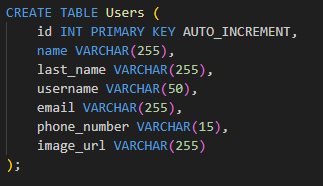
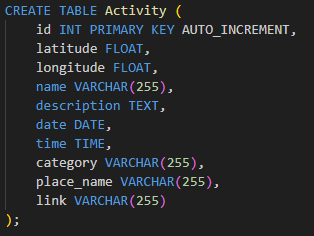
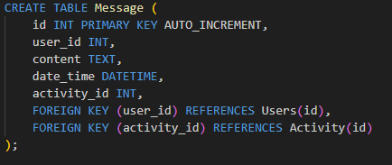
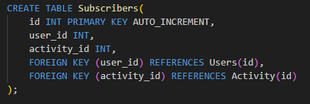
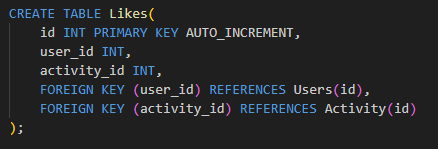
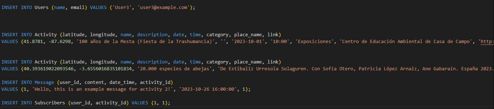

# Meetmap Web

## Prototipo de la Web

Aquí podemos encontrar una presentación del prototipo de la aplicación [FIGMA](https://www.figma.com/proto/2RGyEjivzkksYE1gZ9sY87/MeetMap?type=design&node-id=1-3&t=DGNMYV06qReQG9Mq-0&scaling=min-zoom&page-id=0%3A1&starting-point-node-id=1%3A3)

## Base de datos

### Tablas

Tabla de usuarios

Tabla de actividades

Tabla de mensajes

Tabla de suscriptores

Tabla de favoritos

### Carga de Datos

Carga de datos

###Entregar

Listado de funciones
Permitir que se ejecute
